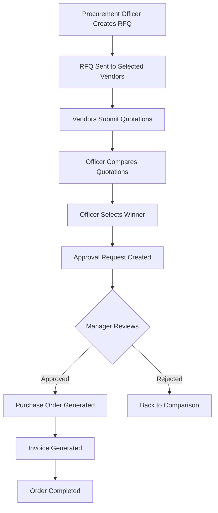

# 🛒 VendorBridge - Procurement Management System

> **Live Demo:** [https://vendorbridgehackathon.netlify.app/](https://vendorbridgehackathon.netlify.app/)

A modern, full-stack procurement management system built with React, Vite, and Supabase. VendorBridge streamlines the entire procurement lifecycle from RFQ creation to purchase order generation.

---

## 📋 Table of Contents

- [Features](#-features)
- [Tech Stack](#-tech-stack)
- [Getting Started](#-getting-started)
- [User Roles](#-user-roles)
- [Procurement Workflow](#-procurement-workflow)
- [Project Structure](#-project-structure)
- [Environment Setup](#-environment-setup)
- [Deployment](#-deployment)
- [Screenshots](#-screenshots)
- [License](#-license)

---

## ✨ Features

### 🔐 Authentication & User Management
- **Secure Login/Signup** with email and password
- **Password Reset** functionality with email verification
- **Role-Based Access Control** (Procurement Officer, Vendor, Manager, Admin)
- **Profile Management** with organization details

### 📦 Vendor Management
- Add, edit, and delete vendor profiles
- Track vendor ratings and performance metrics
- Categorize vendors by industry/service type
- Active/inactive vendor status management
- Optional vendor-user account linking

### 📝 RFQ (Request for Quotation) Management
- **Create RFQs** with multiple line items
- Set priorities (Low, Medium, High, Urgent)
- Define deadlines and specifications
- **Select multiple vendors** for each RFQ
- Track RFQ status throughout lifecycle

### 💼 Quotation Submission
- Vendors can view **all available RFQs**
- Submit detailed quotations with:
  - Item-by-item pricing
  - Delivery timelines
  - Validity period
  - Additional notes
- Automatic total calculations
- Prevention of duplicate quotations

### 🔍 Quotation Comparison
- Side-by-side comparison of vendor quotes
- Highlight best price and fastest delivery
- View detailed item breakdowns
- Select winning quotation for approval

### ✅ Approval Workflow
- Manager/Approver review pending requests
- Timeline visualization of approval stages
- Add approval/rejection remarks
- Automatic PO generation on approval
- Status tracking (Pending, Approved, Rejected)

### 📊 Purchase Orders & Invoicing
- Auto-generate POs from approved quotations
- Track PO status (In Progress, Completed, Cancelled)
- Generate professional invoices with:
  - Line item details
  - Tax calculations (15%)
  - Subtotal and grand total
  - Payment terms
- **Print** or **Download as PDF**
- **Email invoices** directly from the system

### 📈 Reports & Analytics
- **Key Metrics Dashboard**:
  - Total spend (YTD)
  - Active vendors count
  - Total orders
  - Average order value
- **Interactive Charts**:
  - Monthly procurement trends
  - Category distribution (Pie chart)
  - Category spending overview (Bar chart)
- **Vendor Performance Analytics**:
  - Orders per vendor
  - Total spend per vendor
  - Average delivery time
  - Vendor ratings
- **Export Functionality**:
  - **CSV Export**: Vendor performance data
  - **PDF Export**: Complete analytics report

### 📜 Activity Logs
- Comprehensive audit trail
- Track all user actions with timestamps
- Filter by action type and user
- Search functionality
- Real-time activity monitoring

### 🎨 Modern UI/UX
- **Dark theme** for reduced eye strain
- **Responsive design** for all devices
- **Smooth animations** and transitions
- **Card-based layouts** for better organization
- **Interactive charts** with Recharts
- **Loading states** and progress indicators
- **Empty states** with helpful guidance

---

## 🛠 Tech Stack

### Frontend
- **React 18** - UI library
- **Vite** - Build tool and dev server
- **React Router DOM** - Client-side routing (HashRouter)
- **Recharts** - Data visualization and charts
- **Lucide React** - Beautiful icon library
- **CSS3** - Custom styling with CSS variables

### Backend & Database
- **Supabase** - Backend as a Service (BaaS)
  - PostgreSQL database
  - Authentication
  - Real-time subscriptions
  - Row Level Security (RLS)

### Export & Printing
- **jsPDF** - PDF generation
- **html2canvas** - HTML to canvas conversion
- **DOMPurify** - HTML sanitization

### Deployment
- **Netlify** - Frontend hosting and CI/CD
- **Custom domain** support

---

## 🚀 Getting Started

### Prerequisites
- Node.js 16+ and npm
- Supabase account
- Git

### Installation

1. **Clone the repository**
   ```bash
   git clone https://github.com/yourusername/vendorbridge.git
   cd vendorbridge
   ```

2. **Install dependencies**
   ```bash
   npm install
   ```

3. **Set up environment variables**
   
   Create a `.env.local` file in the root directory:
   ```env
   VITE_SUPABASE_URL=your_supabase_project_url
   VITE_SUPABASE_ANON_KEY=your_supabase_anon_key
   ```

4. **Run database migrations**
   
   Execute the SQL in `database_migration.sql` in your Supabase SQL Editor:
   - Adds `user_id` column to vendors table
   - Adds `selected_vendor_user_ids` column to rfqs table
   - Creates necessary indexes

5. **Start development server**
   ```bash
   npm run dev
   ```
   
   Open [http://localhost:5173](http://localhost:5173) in your browser.

6. **Build for production**
   ```bash
   npm run build
   ```
   
   The `dist` folder will contain production-ready files.

---

## 👥 User Roles

### 1. **Procurement Officer**
- Create and manage RFQs
- Compare vendor quotations
- Select winning vendors
- View purchase orders
- Access reports and analytics

### 2. **Vendor**
- View available RFQs
- Submit quotations
- Track quotation status
- View awarded contracts

### 3. **Manager/Approver**
- Review approval requests
- Approve or reject quotations
- Add approval remarks
- View approval history

### 4. **Administrator**
- Full system access
- Manage users and vendors
- System configuration
- Access all reports

---

## 🔄 Procurement Workflow



### Step-by-Step Process

1. **RFQ Creation**
   - Officer creates RFQ with line items and specifications
   - Selects vendors to receive the RFQ
   - Sets deadline and priority

2. **Quotation Submission**
   - All registered vendors can view available RFQs
   - Vendors submit detailed quotations
   - System prevents duplicate submissions

3. **Quotation Comparison**
   - Officer reviews all submitted quotations
   - Side-by-side comparison with highlights
   - Selects the winning quotation

4. **Approval Process**
   - Approval request sent to Manager
   - Manager reviews details and timeline
   - Adds remarks and approves/rejects

5. **Purchase Order**
   - Auto-generated on approval
   - Contains all order details
   - Can be printed or emailed

6. **Invoice Generation**
   - Created from purchase order
   - Includes tax calculations
   - Downloadable as PDF

---

## 📁 Project Structure

```
vendorbridge/
├── public/
│   ├── _redirects          # Netlify SPA routing
│   ├── 404.html           # Custom 404 page
│   ├── favicon.svg        # App icon
│   └── icons.svg          # Icon sprite
├── src/
│   ├── assets/
│   │   └── hero.png       # Landing page hero image
│   ├── components/
│   │   ├── Layout.jsx     # Main app layout
│   │   └── Layout.css     # Layout styles
│   ├── lib/
│   │   ├── supabase.js    # Supabase client config
│   │   └── utils.js       # Helper functions
│   ├── pages/
│   │   ├── ActivityLogs.jsx
│   │   ├── ApprovalWorkflow.jsx
│   │   ├── Auth.jsx       # Login/Signup
│   │   ├── Auth.css
│   │   ├── Dashboard.jsx
│   │   ├── Dashboard.css
│   │   ├── Landing.jsx    # Landing page
│   │   ├── Landing.css
│   │   ├── PurchaseOrderInvoice.jsx
│   │   ├── QuotationComparison.jsx
│   │   ├── QuotationSubmission.jsx
│   │   ├── Reports.jsx
│   │   ├── ResetPassword.jsx
│   │   ├── RFQCreation.jsx
│   │   ├── RFQCreation.css
│   │   ├── SharedPages.css
│   │   ├── VendorManagement.jsx
│   │   └── VendorManagement.css
│   ├── App.jsx            # Main app component
│   ├── App.css            # Global styles
│   ├── main.jsx           # Entry point
│   └── index.css          # Root styles
├── database_migration.sql  # Database schema updates
├── .env.local             # Environment variables (gitignored)
├── .gitignore
├── index.html
├── package.json
├── vite.config.js
├── tailwind.config.js
├── postcss.config.js
├── eslint.config.js
└── README.md
```

---

## ⚙️ Environment Setup

### Supabase Configuration

1. **Create a Supabase project** at [supabase.com](https://supabase.com)

2. **Set up Authentication**
   - Enable Email/Password authentication
   - Configure email templates
   - Set Site URL to your Netlify URL
   - Add redirect URLs:
     ```
     https://your-app.netlify.app/*
     https://your-app.netlify.app/#/reset-password
     http://localhost:5173/*
     ```

3. **Create Database Tables**
   
   Execute this SQL in Supabase SQL Editor:

   ```sql
   -- Profiles table
   CREATE TABLE profiles (
     id UUID PRIMARY KEY REFERENCES auth.users(id),
     full_name TEXT,
     email TEXT,
     organization TEXT,
     role TEXT,
     created_at TIMESTAMP DEFAULT NOW()
   );

   -- Vendors table
   CREATE TABLE vendors (
     id UUID PRIMARY KEY DEFAULT uuid_generate_v4(),
     name TEXT NOT NULL,
     category TEXT,
     email TEXT,
     phone TEXT,
     gst_number TEXT,
     address TEXT,
     status TEXT DEFAULT 'active',
     rating NUMERIC DEFAULT 0,
     total_orders INTEGER DEFAULT 0,
     created_by UUID REFERENCES auth.users(id),
     created_at TIMESTAMP DEFAULT NOW(),
     user_id UUID REFERENCES auth.users(id)
   );

   -- RFQs table
   CREATE TABLE rfqs (
     id UUID PRIMARY KEY DEFAULT uuid_generate_v4(),
     created_by UUID REFERENCES auth.users(id),
     title TEXT NOT NULL,
     category TEXT,
     priority TEXT,
     deadline DATE,
     description TEXT,
     status TEXT DEFAULT 'pending',
     selected_vendors UUID[],
     selected_vendor_user_ids UUID[],
     created_at TIMESTAMP DEFAULT NOW()
   );

   -- RFQ Items table
   CREATE TABLE rfq_items (
     id UUID PRIMARY KEY DEFAULT uuid_generate_v4(),
     rfq_id UUID REFERENCES rfqs(id) ON DELETE CASCADE,
     product_name TEXT NOT NULL,
     quantity INTEGER,
     unit TEXT,
     specifications TEXT,
     created_at TIMESTAMP DEFAULT NOW()
   );

   -- Quotations table
   CREATE TABLE quotations (
     id UUID PRIMARY KEY DEFAULT uuid_generate_v4(),
     rfq_id UUID REFERENCES rfqs(id),
     vendor_id UUID REFERENCES auth.users(id),
     vendor_name TEXT,
     total_amount NUMERIC,
     delivery_timeline TEXT,
     validity_period INTEGER,
     notes TEXT,
     status TEXT DEFAULT 'submitted',
     created_at TIMESTAMP DEFAULT NOW()
   );

   -- Quotation Items table
   CREATE TABLE quotation_items (
     id UUID PRIMARY KEY DEFAULT uuid_generate_v4(),
     quotation_id UUID REFERENCES quotations(id) ON DELETE CASCADE,
     product_name TEXT,
     quantity INTEGER,
     unit TEXT,
     unit_price NUMERIC,
     total NUMERIC,
     created_at TIMESTAMP DEFAULT NOW()
   );

   -- Approvals table
   CREATE TABLE approvals (
     id UUID PRIMARY KEY DEFAULT uuid_generate_v4(),
     rfq_id UUID REFERENCES rfqs(id),
     quotation_id UUID REFERENCES quotations(id),
     requested_by UUID REFERENCES auth.users(id),
     approved_by UUID REFERENCES auth.users(id),
     status TEXT DEFAULT 'pending',
     remarks TEXT,
     created_at TIMESTAMP DEFAULT NOW(),
     updated_at TIMESTAMP DEFAULT NOW()
   );

   -- Purchase Orders table
   CREATE TABLE purchase_orders (
     id UUID PRIMARY KEY DEFAULT uuid_generate_v4(),
     rfq_id UUID REFERENCES rfqs(id),
     quotation_id UUID REFERENCES quotations(id),
     approval_id UUID REFERENCES approvals(id),
     vendor_name TEXT,
     amount NUMERIC,
     tax NUMERIC,
     total NUMERIC,
     status TEXT DEFAULT 'in_progress',
     invoice_generated BOOLEAN DEFAULT FALSE,
     created_at TIMESTAMP DEFAULT NOW()
   );

   -- Activity Logs table
   CREATE TABLE activity_logs (
     id UUID PRIMARY KEY DEFAULT uuid_generate_v4(),
     user_id UUID REFERENCES auth.users(id),
     user_name TEXT,
     action TEXT,
     description TEXT,
     created_at TIMESTAMP DEFAULT NOW()
   );

   -- Create indexes for performance
   CREATE INDEX idx_vendors_user_id ON vendors(user_id);
   CREATE INDEX idx_rfqs_vendor_user_ids ON rfqs USING GIN(selected_vendor_user_ids);
   CREATE INDEX idx_rfqs_status ON rfqs(status);
   CREATE INDEX idx_quotations_rfq_id ON quotations(rfq_id);
   CREATE INDEX idx_approvals_status ON approvals(status);
   ```

4. **Set up Row Level Security (RLS)**
   
   Enable RLS and create appropriate policies for each table based on user roles.

---

## 🚀 Deployment

### Deploy to Netlify

1. **Build the project**
   ```bash
   npm run build
   ```

2. **Deploy to Netlify**
   - Connect your GitHub repository to Netlify
   - Or drag and drop the `dist` folder to Netlify
   - Set build command: `npm run build`
   - Set publish directory: `dist`

3. **Configure Environment Variables**
   
   In Netlify dashboard, add:
   - `VITE_SUPABASE_URL`
   - `VITE_SUPABASE_ANON_KEY`

4. **Update Supabase Settings**
   - Set Site URL to your Netlify URL
   - Update redirect URLs

### Manual Deployment

```bash
# Build
npm run build

# Deploy dist folder to your hosting provider
```

---

## 📸 Screenshots

### Landing Page
Modern landing page with hero section and feature highlights.

### Dashboard
Comprehensive dashboard with key metrics, recent activities, and quick actions.

### RFQ Creation
Intuitive form for creating RFQs with multiple line items and vendor selection.

### Quotation Comparison
Side-by-side comparison with visual indicators for best price and delivery.

### Reports & Analytics
Interactive charts and comprehensive vendor performance analytics.

### Invoice Generation
Professional invoices with print and PDF download options.

---

## 🔧 Development

### Available Scripts

```bash
# Start development server
npm run dev

# Build for production
npm run build

# Preview production build
npm run preview

# Lint code
npm run lint
```

### Key Features to Note

- **HashRouter**: Used for compatibility with Netlify SPA routing
- **Dark Theme**: Implemented with CSS variables for easy customization
- **Responsive Design**: Mobile-first approach with breakpoints
- **Error Handling**: Comprehensive error handling with user-friendly messages
- **Loading States**: Smooth loading indicators throughout the app
- **Empty States**: Helpful guidance when no data is available

---

## 🤝 Contributing

Contributions are welcome! Please follow these steps:

1. Fork the repository
2. Create a feature branch (`git checkout -b feature/AmazingFeature`)
3. Commit your changes (`git commit -m 'Add some AmazingFeature'`)
4. Push to the branch (`git push origin feature/AmazingFeature`)
5. Open a Pull Request

---

## 📝 License

This project is licensed under the MIT License - see the LICENSE file for details.

---

## 🙏 Acknowledgments

- **Supabase** for the excellent BaaS platform
- **Recharts** for beautiful data visualizations
- **Lucide** for the comprehensive icon library
- **Netlify** for seamless deployment

---

## 📞 Support

For support, email support@vendorbridge.com or open an issue in the repository.

---

## 🌟 Star History

If you find this project useful, please consider giving it a ⭐️!

---

**Built with ❤️ using React, Vite, and Supabase**

**Live Demo:** [https://vendorbridgehackathon.netlify.app/](https://vendorbridgehackathon.netlify.app/)
